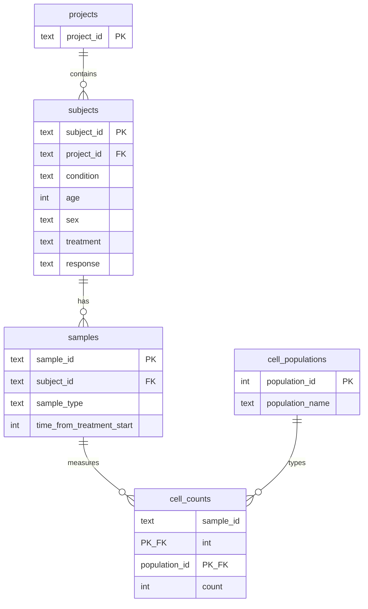

# Loblaw Bio — Immune Cell Population Analysis

Python analysis pipeline and interactive dashboard for Bob Loblaw's clinical trial evaluating how miraclib affects immune cell populations in melanoma patients.

## Quick Start

```bash
make setup      # Install dependencies
make pipeline   # Load data and generate all outputs
make dashboard  # Launch interactive dashboard at http://localhost:8501
```

Individual steps:

```bash
python load_data.py    # Part 1: Create loblaw_bio.db and load cell-count.csv
python run_pipeline.py # Parts 2-4: Generate tables, plots, and reports
```

## Dashboard

After running `make dashboard`, open:

**http://localhost:8501**

The dashboard provides four tabs:

- **Frequency Overview** — Part 2 summary with interactive filters
- **Response Analysis** — Part 3 responder vs non-responder boxplots and significance table
- **Baseline Subset** — Part 4 baseline miraclib melanoma PBMC breakdown
- **Generated Outputs** — All pipeline CSV/JSON/PNG artifacts

## Project Structure

```
.
├── cell-count.csv              # Input data
├── load_data.py                # Part 1: database initialization and loading
├── run_pipeline.py             # Orchestrates Parts 2-4
├── loblaw_bio.db               # Generated SQLite database
├── Makefile                    # Grading targets: setup, pipeline, dashboard
├── requirements.txt
├── output/                     # Generated analysis artifacts
├── dashboard/
│   └── app.py                  # Streamlit interactive dashboard
└── src/
    ├── config.py               # Shared paths and constants
    ├── schema.py               # Database DDL
    └── analysis/
        ├── overview.py         # Part 2: frequency summary
        ├── statistics.py       # Part 3: responder comparison + boxplots
        └── subset.py           # Part 4: baseline subset queries
```

### Design Rationale

The project separates **data loading** (`load_data.py`), **batch analysis** (`run_pipeline.py` + `src/analysis/`), and **interactive exploration** (`dashboard/app.py`). This keeps the grading entry points simple (`make pipeline`, `make dashboard`) while allowing each layer to evolve independently.

- `load_data.py` lives at the repository root as required and has no CLI arguments.
- Analysis modules query the normalized database rather than re-reading the CSV, ensuring Parts 2-4 share a single source of truth.
- Output artifacts are written to `output/` so graders and the dashboard can consume the same files.

## Database Schema

The data is stored in a normalized relational schema designed for analytical queries across projects, subjects, samples, and cell populations.



### Tables

| Table | Purpose |
|-------|---------|
| `projects` | Clinical trial projects (`prj1`, `prj2`, `prj3`) |
| `subjects` | Patient demographics, treatment, and response status |
| `samples` | Individual biospecimens linked to subjects |
| `cell_populations` | Reference list of immune cell types |
| `cell_counts` | Measured counts per sample per population |

### Why This Design?

1. **Normalization avoids redundancy** — Subject metadata (age, sex, treatment, response) is stored once per patient, not repeated across timepoints.
2. **Long-format cell counts** — Storing populations as rows (not wide CSV columns) makes it easy to add new cell types without schema migrations.
3. **Indexed foreign keys** — Indexes on `project_id`, `condition`, `treatment`, `response`, `sample_type`, and `time_from_treatment_start` support fast filtering for cohort-specific analyses.
4. **Scalability** — With hundreds of projects and thousands of samples:
   - New projects insert one row into `projects` and bulk-load subjects/samples
   - Analytical queries use JOINs + window functions (as in Part 2) without reshaping
   - Additional fact tables (e.g., gene expression, cytokine levels) can reference `samples` without duplicating metadata
   - Partitioning or attaching per-project databases becomes feasible at very large scale

## Analysis Outputs

| File | Description |
|------|-------------|
| `output/frequency_summary.csv` | Part 2: per-sample population frequencies |
| `output/miraclib_pbmc_comparison.csv` | Part 3: melanoma PBMC miraclib comparison data |
| `output/significance_report.csv` | Part 3: Mann-Whitney U test results per population |
| `output/response_comparison_boxplot.png` | Part 3: responder vs non-responder boxplots |
| `output/baseline_subset_summary.json` | Part 4: baseline subset counts |
| `output/baseline_subset_summary.csv` | Part 4: tabular summary |
| `output/baseline_subset_samples.csv` | Part 4: individual baseline sample records |

### Part 3 Statistical Method

For each immune cell population, relative frequencies (%) from melanoma PBMC miraclib samples are compared between responders (`response = yes`) and non-responders (`response = no`) using the **Mann-Whitney U test** (two-sided). This non-parametric test is appropriate for potentially skewed count-derived percentages. Benjamini-Hochberg FDR correction is applied across the five populations. Populations with nominal p < 0.05 are reported as significant.

### Part 4 Baseline Subset

Filters to melanoma patients treated with miraclib, PBMC sample type, baseline (`time_from_treatment_start = 0`), then reports:

- Sample counts per project
- Unique subject counts by response (yes/no)
- Unique subject counts by sex (M/F)

## Requirements

- Python 3.10+
- See `requirements.txt` for package dependencies
